<div align="center">



</div>

<br>

<div align="center">

  <a href="https://github.com/watarikai96/TiME">
    
  </a>
  <a href="https://rahuls.vercel.app">
    
  </a>
  <a href="mailto:watarikai@outlook.com">
    
  </a>
  <a href="https://orcid.org/0009-0004-7132-3883">
    
  </a>

</div>

<br>

## What I am doing right now

Building **[TiME](https://github.com/watarikai96/TiME)**　& **[Stratabase](https://github.com/watarikai96/Stratabase)** 
Solo founder, Tokyo.

<br>

## Stack

<div align="center">


</div>

<br>

## Contribution Graph

<picture>
  <source media="(prefers-color-scheme: dark)" srcset="https://raw.githubusercontent.com/watarikai96/watarikai96/output/github-contribution-grid-snake-dark.svg">
  <source media="(prefers-color-scheme: light)" srcset="https://raw.githubusercontent.com/watarikai96/watarikai96/output/github-contribution-grid-snake.svg">
  
</picture>

<br>

## Streak

<div align="center">


</div>

<br>

## How I work

```
schedule
  weekday  06:00-07:30 JST  morning block, planning + design
  weekday  20:00-22:00 JST  evening block, coding
  weekend  6-10h flexible    deep work, parallel learning
  hard stop 22:00 JST        every day, no exceptions

cadence
  daily    one YouTrack ticket moves at least one column
  weekly   Sunday evening, 5-line public log
  monthly  metric thread on X
  quarter  retrospective + BIBLE update

stack discipline
  one platform at a time
  one persona entry point
  one market focus
  one voice
  AI maximalist
```

<br>

## Find me

- Email: watarikai@outlook.com
- ORCID: [0009-0004-7132-3883](https://orcid.org/0009-0004-7132-3883)

<br>

---

<br>

<div align="center">

<br><br>


</div>
